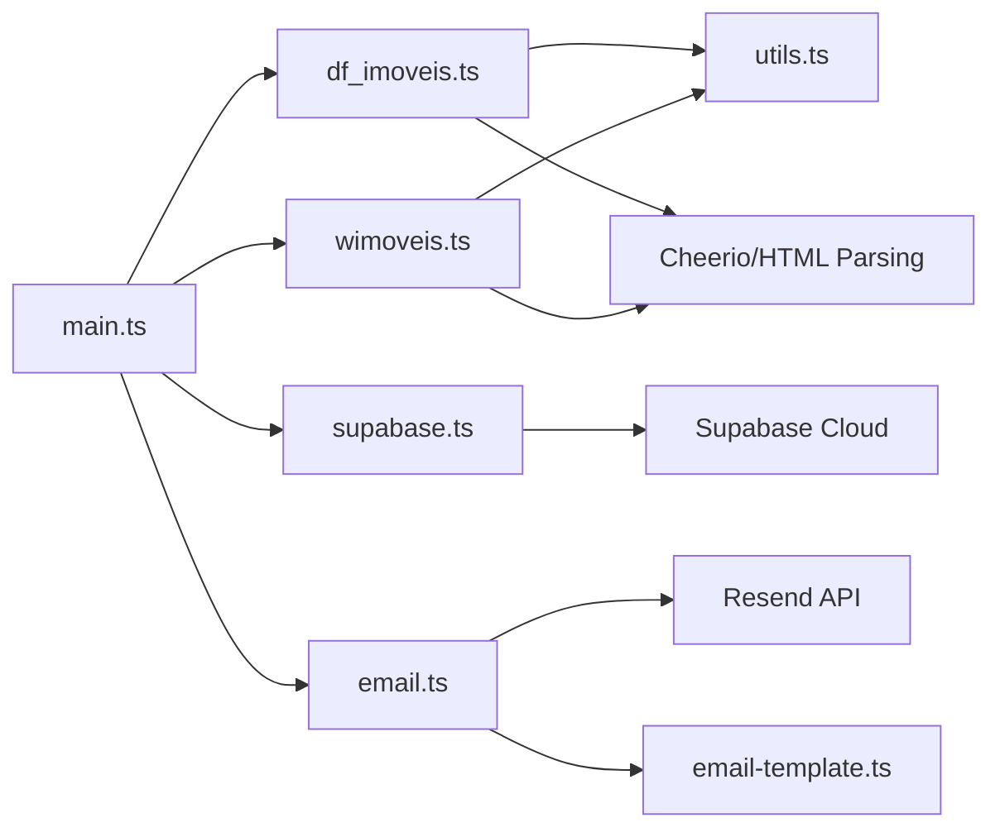

# House Crawler 🏠

> Sistema automatizado de monitoramento de imóveis que realiza web scraping em múltiplos portais imobiliários, detecta novos anúncios e envia notificações por email.

[](https://deno.land/)
[](https://www.typescriptlang.org/)
[](https://supabase.com/)
[](https://resend.com/)

---

## 📑 Índice

- [Sobre o Projeto](#-sobre-o-projeto)
- [Funcionalidades](#-funcionalidades)
- [Tecnologias Utilizadas](#️-tecnologias-utilizadas)
- [Pré-requisitos](#-pré-requisitos)
- [Configuração](#️-configuração)
- [Uso](#-uso)
- [Arquitetura do Sistema](#️-arquitetura-do-sistema)
- [Estrutura de Arquivos](#️-estrutura-de-arquivos)
- [Estrutura da Tabela](#-estrutura-da-tabela-real_states)
- [Comandos Úteis](#-comandos-úteis)
- [Personalizando os Crawlers](#-personalizando-os-crawlers)
- [Automação com Cron](#-automação-com-cron)
- [Notas Importantes](#-notas-importantes)
- [Entendendo o robots.txt](#-entendendo-o-robotstxt)
- [Segurança](#-segurança)
- [Troubleshooting](#-troubleshooting)
- [Contribuindo](#-contribuindo)
- [Roadmap Futuro](#-roadmap-futuro)
- [Licença](#-licença)

---

## ⚡ Quick Start

```bash
# 1. Clone o repositório
git clone <seu-repo>
cd house-crawler

# 2. Configure as variáveis de ambiente
cp .env.example .env
# Edite o .env com suas credenciais

# 3. Execute o crawler
deno task run
```

Para configuração detalhada, veja a [seção de configuração](#️-configuração).

---

## 📖 Sobre o Projeto

O **House Crawler** é uma ferramenta desenvolvida em TypeScript com Deno que automatiza a busca por imóveis em sites de classificados. Ele foi projetado para coletar informações de apartamentos/casas que atendem a critérios específicos (localização, número de quartos, valor, etc.) e notificar o usuário quando novos anúncios são publicados.

### Caso de Uso

Ideal para quem está procurando imóvel e quer ser notificado automaticamente quando novos anúncios aparecem nos portais, sem precisar verificar manualmente todos os dias.

### Como Funciona em Resumo

```
1. Crawlers acessam DF Imóveis e Wimoveis
2. Extraem dados dos imóveis (título, valor, link)
3. Sincronizam com Supabase (só novos são inseridos)
4. Enviam email via Resend se houver novos imóveis
```

## 🚀 Funcionalidades

- ✅ Coleta automática de imóveis de diferentes sites:
  - **DF Imóveis** (configurado para Asa Norte/Sul)
  - **Wimoveis** (configurado para Brasília)
- 💾 Armazenamento em banco de dados Supabase com detecção de duplicatas
- 📧 Notificação por email com novos imóveis encontrados (usando Resend)
- 🔄 Sincronização inteligente: apenas novos imóveis são inseridos
- 🛡️ Sistema de detecção de duplicatas baseado no link do anúncio
- ⏱️ Delay entre requisições para evitar bloqueios (rate limiting)
- 📊 Relatórios detalhados de execução no console

## 🛠️ Tecnologias Utilizadas

- **[Deno](https://deno.land/)** - Runtime TypeScript/JavaScript moderno e seguro
- **[TypeScript](https://www.typescriptlang.org/)** - Linguagem com tipagem estática
- **[Cheerio](https://cheerio.js.org/)** - Biblioteca para parsing e manipulação de HTML (jQuery-like)
- **[Supabase](https://supabase.com/)** - Backend-as-a-Service com PostgreSQL
- **[Resend](https://resend.com/)** - API moderna para envio de emails

### Por que Deno?

- ✅ TypeScript nativo (sem configuração)
- ✅ Permissões explícitas (segurança)
- ✅ Gerenciamento de dependências moderno (sem `node_modules`)
- ✅ Ferramentas integradas (formatter, linter, test runner)
- ✅ Suporte nativo a variáveis de ambiente

## 📋 Pré-requisitos

- [Deno](https://deno.land/) v1.40 ou superior
- Conta no [Supabase](https://supabase.com/) (gratuita)
- Conta no [Resend](https://resend.com/) (gratuita para até 100 emails/dia)

## ⚙️ Configuração

### 1. Configurar o Supabase

1. Crie um novo projeto no [Supabase](https://app.supabase.com/)
2. No SQL Editor do Supabase, execute o script `setup-supabase.sql` para criar a
   tabela
3. Obtenha suas credenciais em **Settings > API**:
   - Project URL
   - Anon/Public Key

### 2. Configurar o Resend

1. Crie uma conta em [Resend](https://resend.com/)
2. Obtenha sua API Key em **API Keys**
3. (Opcional) Configure um domínio personalizado em **Domains**

### 3. Configurar Variáveis de Ambiente

Crie um arquivo `.env` na raiz do projeto com o seguinte conteúdo:

```bash
# Supabase Configuration
SUPABASE_URL=https://seu-projeto-id.supabase.co
SUPABASE_ANON_KEY=sua-chave-anon-aqui

# Email Configuration (Resend)
RESEND_API_KEY=re_sua_chave_api_aqui

# Email de origem (remetente)
# Para testes, use: onboarding@resend.dev
# Para produção, use seu domínio verificado
FROM_EMAIL=imoveis@seudominio.com

# Emails de destino (destinatários separados por vírgula)
TO_EMAILS=seu.email@example.com,outro.email@example.com
```

**✨ O arquivo `.env` é carregado automaticamente!** Não é necessário exportar
as variáveis manualmente.

**Importante:**

- O arquivo `.env` já está no `.gitignore` e não será commitado
- `TO_EMAILS` aceita múltiplos emails separados por vírgula
- Para testes, use `onboarding@resend.dev` como `FROM_EMAIL`

### 4. Instalar Dependências

As dependências serão instaladas automaticamente pelo Deno ao executar o
projeto.

## 🎯 Uso

### Testar Configuração de Email

Antes de executar o crawler completo, teste a configuração de email:

```bash
deno task test-email
```

### Executar o Crawler

```bash
deno task run
```

Ou diretamente:

```bash
deno run --allow-net --allow-write --allow-env src/main.ts
```

### O que acontece ao executar?

1. 🔍 Coleta imóveis de todos os sites configurados
2. 💾 Salva backup local em `imoveis.json`
3. ☁️ Sincroniza com Supabase:
   - Novos imóveis são inseridos
   - Imóveis já existentes (mesmo link) são ignorados
4. 📧 Envia email de notificação com os novos imóveis (se houver)
5. 📊 Exibe relatório com número de imóveis novos e status do email

## 🏗️ Arquitetura do Sistema

### Fluxo de Dados



### Processo de Execução

1. **Inicialização** (`main.ts`)
   - Carrega variáveis de ambiente do arquivo `.env`
   - Inicia o processo de coleta

2. **Coleta de Dados** (Crawlers)
   - `df_imoveis.ts`: Acessa a página de listagem do DF Imóveis
   - `wimoveis.ts`: Acessa a página de listagem do Wimoveis
   - Para cada site:
     - Extrai links de todos os imóveis da listagem
     - Acessa cada link individualmente
     - Faz parsing do HTML usando Cheerio
     - Extrai título, valor e link do imóvel
     - Aguarda 1.2s entre requisições (rate limiting)

3. **Sincronização com Banco de Dados** (`supabase.ts`)
   - Consulta quais imóveis já existem (baseado no link)
   - Filtra apenas os novos imóveis
   - Insere apenas os que ainda não estão no banco

4. **Notificação** (`email.ts`)
   - Se houver novos imóveis:
     - Gera email HTML e texto usando template
     - Envia via Resend para os destinatários configurados

## 🗂️ Estrutura de Arquivos

```
house-crawler/
├── src/
│   ├── main.ts              # 🎯 Ponto de entrada e orquestração
│   ├── df_imoveis.ts        # 🏢 Crawler para DF Imóveis
│   ├── wimoveis.ts          # 🏢 Crawler para Wimoveis
│   ├── supabase.ts          # 💾 Integração com Supabase
│   ├── email.ts             # 📧 Envio de emails via Resend
│   ├── email-template.ts    # 📝 Template HTML/texto dos emails
│   ├── robots.ts            # 🤖 Verificação de robots.txt
│   ├── types.ts             # 📐 Definições de tipos TypeScript
│   ├── utils.ts             # 🛠️ Funções utilitárias
│   ├── database.types.ts    # 🗄️ Tipos gerados do Supabase
│   ├── test-connection.ts   # 🧪 Teste de conexão Supabase
│   ├── test-email.ts        # 🧪 Teste de envio de email
│   └── test-robots.ts       # 🧪 Teste de robots.txt
├── deno.json                # ⚙️ Configuração Deno e tasks
├── setup-supabase.sql       # 🗃️ Script de criação da tabela
└── .env                     # 🔐 Variáveis de ambiente (criar)
```

### Descrição dos Módulos

#### 📌 `main.ts` - Orquestrador Principal
Ponto de entrada do sistema. Coordena a execução de todas as etapas:
- Carrega configurações do `.env`
- Chama os crawlers sequencialmente
- Agrega os resultados
- Sincroniza com Supabase
- Envia notificações por email

#### 🕷️ `df_imoveis.ts` e `wimoveis.ts` - Crawlers
Cada crawler segue o mesmo padrão:
1. **`collectListingLinks()`**: Extrai todos os links de imóveis da página de listagem
2. **`parseProperty()`**: Acessa cada link e extrai os dados do imóvel
3. **`extract**()`**: Funções específicas para extrair título, preço, etc.

**Estratégias de Parsing:**
- Usam Cheerio para navegação no DOM HTML
- Seletores CSS customizados para cada site
- Normalização de texto (remoção de espaços extras)
- Construção de URLs absolutas
- Validação de domínio

#### 💾 `supabase.ts` - Gerenciamento de Dados
- **`getSupabaseClient()`**: Cria e retorna instância do cliente Supabase (singleton)
- **`insertNewProperties()`**: Lógica de inserção inteligente
  - Consulta links existentes no banco
  - Filtra apenas novos imóveis
  - Insere em batch

**Estratégia de Deduplicação:**
O campo `link` é a chave primária, garantindo que o mesmo imóvel não seja inserido duas vezes.

#### 📧 `email.ts` - Sistema de Notificações
- Validação de configuração (API key, emails)
- Geração de conteúdo HTML e texto
- Envio via Resend API
- Suporte a múltiplos destinatários
- Tratamento de erros robusto

#### 🎨 `email-template.ts` - Templates de Email
- **`generateEmailHTML()`**: Template HTML responsivo
- **`generateEmailText()`**: Versão texto simples
- Formatação de valores, links e informações

#### 🛠️ `utils.ts` - Utilitários
- **`fetchDocument()`**: Busca e faz parsing de páginas HTML
- **`normalizeWhitespace()`**: Remove espaços extras e quebras de linha
- **`buildAbsoluteUrl()`**: Constrói URLs absolutas a partir de relativas
- **`isSameDomain()`**: Valida se URL pertence ao domínio esperado
- **`printProperty()`**: Exibe imóvel no console formatado

#### 🤖 `robots.ts` - Verificação de robots.txt
Módulo opcional para web scraping ético:
- **`fetchRobotsTxt()`**: Baixa o robots.txt de um site
- **`parseRobotsTxt()`**: Faz parsing do conteúdo
- **`isUrlAllowed()`**: Verifica se URL é permitida
- **`checkUrlAgainstRobotsTxt()`**: Função auxiliar completa

**Nota:** Este módulo é educacional. O erro 403 que você recebe vem de um firewall/WAF, não do robots.txt. As URLs atuais do crawler **respeitam** o robots.txt de ambos os sites.

#### 📐 `types.ts` - Tipos
```typescript
interface Property {
  titulo: string;  // Título/descrição do imóvel
  valor: string;   // Valor (formato texto)
  link: string;    // URL do anúncio (chave primária)
}
```

## 📊 Estrutura da Tabela `real_states`

| Coluna     | Tipo      | Descrição                       |
| ---------- | --------- | ------------------------------- |
| link       | TEXT (PK) | URL do anúncio (chave primária) |
| titulo     | TEXT      | Título do anúncio               |
| valor      | TEXT      | Valor do imóvel                 |
| created_at | TIMESTAMP | Data da primeira coleta         |

## 🔧 Comandos Úteis

```bash
# Testar conexão com Supabase
deno task test

# Testar configuração de email
deno task test-email

# Verificar robots.txt dos sites
deno task test-robots

# Executar o crawler
deno task run

# Formatar código
deno task fmt

# Lint
deno task lint
```

## 🎨 Personalizando os Crawlers

### Modificar Critérios de Busca

Os critérios de busca estão definidos nas URLs de listagem de cada crawler:

**DF Imóveis** (`src/df_imoveis.ts`):
```typescript
const LIST_URL =
  "https://www.dfimoveis.com.br/venda/df/brasilia/asa-norte,asa-sul/imoveis/3,4-quartos?suites=1&vagasdegaragem=1&valorfinal=1200000&areainicial=90";
```

**Wimoveis** (`src/wimoveis.ts`):
```typescript
const LIST_URL =
  "https://www.wimoveis.com.br/venda/apartamentos/brasil/desde-3-ate-4-quartos/areac-elevador?areaUnit=1&bathroom=2&coveredArea=90,&loc=Z:42705,42704&price=,1200000";
```

Você pode ajustar os parâmetros diretamente na URL ou usar o site para fazer uma busca e copiar a URL resultante.

### Adicionar Novos Sites

Para adicionar um novo site de imóveis:

1. Crie um novo arquivo (ex: `src/novo_site.ts`)
2. Implemente as funções:
   ```typescript
   async function collectListingLinks(listUrl: string): Promise<string[]>
   async function parseProperty(url: string): Promise<Property>
   export async function collectNovoSiteProperties(): Promise<Property[]>
   ```
3. Use os seletores CSS apropriados para extrair os dados
4. Adicione no `main.ts`:
   ```typescript
   import { collectNovoSiteProperties } from "./novo_site.ts";
   const novoSiteProperties = await collectNovoSiteProperties();
   ```

### Ajustar Rate Limiting

O delay entre requisições está configurado em 1.2 segundos. Para ajustar:

```typescript
await delay(1200); // Altere o valor em milissegundos
```

## 🔄 Automação com Cron

Para executar o crawler automaticamente em intervalos regulares:

### Linux/macOS (crontab)

```bash
# Editar crontab
crontab -e

# Executar todo dia às 9h e 18h
0 9,18 * * * cd /caminho/para/house-crawler && /caminho/para/deno task run >> /tmp/house-crawler.log 2>&1
```

### GitHub Actions

⚠️ **Limitação**: Alguns sites podem bloquear requisições do GitHub Actions (erro 403). O crawler continuará funcionando com os sites que não bloquearem.

Crie `.github/workflows/crawler.yml`:

```yaml
name: House Crawler
on:
  schedule:
    - cron: '0 9,18 * * *'  # 9h e 18h UTC
  workflow_dispatch:

jobs:
  crawl:
    runs-on: ubuntu-latest
    steps:
      - uses: actions/checkout@v3
      - uses: denoland/setup-deno@v1
        with:
          deno-version: v2.x
      - name: Run crawler
        env:
          SUPABASE_URL: ${{ secrets.SUPABASE_URL }}
          SUPABASE_ANON_KEY: ${{ secrets.SUPABASE_ANON_KEY }}
          RESEND_API_KEY: ${{ secrets.RESEND_API_KEY }}
          FROM_EMAIL: ${{ secrets.FROM_EMAIL }}
          TO_EMAILS: ${{ secrets.TO_EMAILS }}
        run: deno task run
```

**Configurar Secrets no GitHub:**
1. Vá em Settings > Secrets and variables > Actions
2. Adicione cada variável de ambiente como um secret

## 📝 Notas Importantes

### Funcionamento
- A chave primária é o `link`, garantindo que não haja duplicatas
- Imóveis já cadastrados são automaticamente ignorados
- O campo `created_at` registra quando o imóvel foi visto pela primeira vez
- Emails são enviados apenas quando há novos imóveis encontrados
- O template de email é responsivo e funciona em todos os clientes de email

### Tratamento de Erros
- Se houver erro ao coletar um imóvel específico, ele é registrado no console e o crawler continua
- Se houver erro ao sincronizar com Supabase, o processo é interrompido
- Se houver erro ao enviar email, o processo é interrompido

### Performance
- Delay de 1.2s entre requisições evita bloqueios por rate limiting
- Inserção em batch no Supabase (mais eficiente)
- Consulta prévia de links existentes minimiza operações desnecessárias

### Web Scraping Ético
- ✅ Respeita robots.txt dos sites
- ✅ Implementa delays entre requisições (1.2s)
- ✅ Usa User-Agent identificável (navegador real)
- ✅ Não sobrecarrega os servidores
- ✅ Acessa apenas páginas públicas de listagem
- ⚠️ Sites podem alterar sua estrutura HTML - nesse caso, os seletores CSS precisarão ser atualizados

**Verificação do robots.txt:**
```bash
# Verificar se suas URLs respeitam o robots.txt
deno task test-robots
```

**Status atual:**
- ✅ DF Imóveis: Nossas URLs são permitidas
- ✅ Wimoveis: Nossas URLs são permitidas
- ⚠️ O erro 403 vem de firewall/WAF, não do robots.txt

## 🤖 Entendendo o robots.txt

### O Que É?

O `robots.txt` é um arquivo na raiz de sites (`https://exemplo.com/robots.txt`) que indica quais partes do site podem ser acessadas por bots/crawlers. É um "acordo de cavalheiros" da web.

### Como Funciona?

```
User-agent: *           # Aplica-se a todos os bots
Disallow: /admin/       # Proíbe acesso a /admin/
Disallow: /api/         # Proíbe acesso a /api/
Allow: /api/public/     # Permite /api/public/ (exceção)
```

### Status dos Sites Monitorados

**DF Imóveis:**
```
✅ Permitido: /venda/... (páginas públicas de listagem)
✅ Permitido: /imovel/... (páginas de detalhes)
❌ Bloqueado: /favoritos/, /conta/, /visitas/ (áreas privadas)
```

**Wimoveis:**
```
✅ Permitido: Páginas de listagem com filtros
❌ Bloqueado: ?sort=*, ?page=>5, tracking, APIs internas
```

### Nosso Crawler Respeita?

**Sim!** ✅ Todas as URLs que acessamos são permitidas pelos respectivos `robots.txt`.

Você pode verificar com:
```bash
deno task test-robots
```

### Então Por Que o Erro 403?

O `robots.txt` é **opcional** e **informativo**. Sites podem:
- Ter robots.txt E proteção adicional (firewall/WAF)
- Bloquear IPs de data centers (como GitHub Actions)
- Usar proteção anti-bot (Cloudflare, etc.)

**O erro 403 vem de um firewall/WAF, não do robots.txt.**

### Leitura Adicional

- [RFC 9309 - Robots Exclusion Protocol](https://www.rfc-editor.org/rfc/rfc9309.html)
- [Google Search Central - robots.txt](https://developers.google.com/search/docs/crawling-indexing/robots/intro)

---

## 🔒 Segurança

### Boas Práticas Implementadas

- ✅ Variáveis de ambiente em arquivo `.env` (não commitado)
- ✅ Uso de chave `ANON_KEY` para operações públicas
- ✅ Políticas RLS (Row Level Security) no Supabase
- ✅ Validação de dados antes de inserção
- ✅ Tratamento adequado de erros

### Recomendações Adicionais

- 🔐 Configure políticas RLS personalizadas no Supabase conforme necessário
- 🔑 Nunca commit suas chaves de API no repositório
- 🔄 Rotacione suas chaves periodicamente
- 📧 Use domínio verificado no Resend para evitar spam

## 🐛 Troubleshooting

### Erro: "Variáveis de ambiente não encontradas"

**Solução**: Verifique se o arquivo `.env` existe na raiz do projeto e contém todas as variáveis necessárias.

### ⚠️ Erro 403 Forbidden no GitHub Actions

**Problema**: O crawler funciona localmente mas falha no GitHub Actions com erro `403 Forbidden`.

**Causa**: Sites imobiliários bloqueiam requisições vindas de IPs de data centers (como os do GitHub Actions) para se proteger de bots.

**Soluções:**

#### 1️⃣ Solução Recomendada: Aceitar a Limitação
O código já está preparado para lidar com isso:
- Se um site retornar 403, ele será pulado
- O crawler continuará com os outros sites
- Você receberá email apenas dos sites que funcionaram

#### 2️⃣ Alternativa: Rodar Localmente com Cron
Execute o crawler em sua própria máquina ao invés do GitHub Actions:

```bash
# Linux/macOS - Edite o crontab
crontab -e

# Adicione (executar 2x por dia):
0 9,18 * * * cd /caminho/para/house-crawler && deno task run >> /tmp/crawler.log 2>&1
```

#### 3️⃣ Alternativa: Usar VPS/Servidor Próprio
Deploy em um servidor VPS (DigitalOcean, AWS, etc.):
- IPs residenciais têm menos chance de bloqueio
- Mais controle sobre o ambiente
- Pode usar proxies se necessário

#### 4️⃣ Alternativa Avançada: Usar Proxy (Pago)
Adicione suporte a proxies residenciais nos crawlers:
```typescript
const PROXY_URL = Deno.env.get("PROXY_URL");
// Configurar proxy nas requisições
```

**Nota**: Web scraping deve respeitar os termos de uso dos sites. O erro 403 é a forma do site indicar que não quer ser acessado automaticamente.

### Erro ao coletar imóveis (HTTP 404)

**Causa**: A URL de listagem mudou ou não existe mais.

**Solução**: 
1. Verifique se a URL de listagem ainda está válida
2. Acesse o site manualmente e copie a nova URL
3. Atualize a constante `LIST_URL` no crawler correspondente

### Emails não estão sendo enviados

**Verificações**:
1. Execute `deno task test-email` para testar a configuração
2. Verifique se `RESEND_API_KEY` está correta
3. Confirme que `TO_EMAILS` está no formato correto
4. Se usar domínio personalizado, verifique se está verificado no Resend

### Imóveis duplicados no banco

**Causa**: Improável, pois o `link` é chave primária.

**Solução**: Verifique se a função `insertNewProperties` está sendo chamada corretamente.

### Performance lenta

**Possíveis causas**:
- Muitos imóveis na listagem
- Latência de rede alta
- Rate limiting dos sites

**Soluções**:
- Aumente o delay entre requisições
- Filtre melhor os critérios de busca
- Execute em horários de menor tráfego

## 🤝 Contribuindo

Contribuições são bem-vindas! Sinta-se à vontade para:

1. **Adicionar novos sites**: Crie crawlers para outros portais imobiliários
2. **Melhorar parsers**: Otimizar a extração de dados
3. **Adicionar recursos**: Filtros avançados, mais campos de dados, etc.
4. **Reportar bugs**: Abra uma issue descrevendo o problema
5. **Melhorar documentação**: Correções e esclarecimentos

### Como Contribuir

1. Fork o projeto
2. Crie uma branch para sua feature (`git checkout -b feature/nova-funcionalidade`)
3. Commit suas mudanças (`git commit -m 'Adiciona nova funcionalidade'`)
4. Push para a branch (`git push origin feature/nova-funcionalidade`)
5. Abra um Pull Request

## 📊 Roadmap Futuro

Possíveis melhorias planejadas:

- [ ] Suporte a mais portais imobiliários (OLX, VivaReal, Imovelweb)
- [ ] Interface web para configuração
- [ ] Filtros avançados (distância de pontos de interesse, etc.)
- [ ] Análise de preços e alertas de oportunidades
- [ ] Histórico de variação de preços
- [ ] Integração com Telegram/WhatsApp
- [ ] Dashboard com estatísticas
- [ ] Detecção de imóveis removidos

## 📄 Licença

Este projeto é de código aberto e está disponível sob a licença MIT.

---

## 📞 Suporte

Se você encontrou algum problema ou tem sugestões:

- 🐛 Abra uma [issue](../../issues) no GitHub
- 💡 Compartilhe ideias de melhorias
- ⭐ Dê uma estrela se este projeto foi útil!

---

**Desenvolvido com ❤️ usando Deno e TypeScript**

*Última atualização: Outubro 2025*
